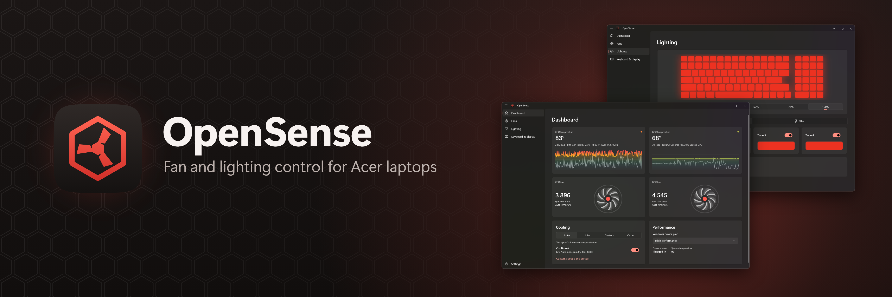

<div align="center">



**Fan, performance and lighting control for Acer Nitro and Predator laptops.**<br>
An open-source replacement for NitroSense and PredatorSense.

[](https://github.com/archivesteak/opensense/actions/workflows/build.yml)
[](https://github.com/archivesteak/opensense/releases/latest)
[](LICENSE)

[**Download**](https://github.com/archivesteak/opensense/releases/latest) •
[Features](#features) •
[Supported laptops](#supported-laptops) •
[Building](#building)

**English** |
[Bahasa Indonesia](docs/README-id.md) |
[Deutsch](docs/README-de.md) |
[Español](docs/README-es.md) |
[Français](docs/README-fr.md) |
[Polski](docs/README-pl.md) |
[Português (Brasil)](docs/README-pt-BR.md) |
[Tiếng Việt](docs/README-vi.md) |
[Türkçe](docs/README-tr.md) |
[Русский](docs/README-ru.md) |
[Українська](docs/README-uk.md) |
[简体中文](docs/README-zh-CN.md) |
[繁體中文](docs/README-zh-TW.md)

Help translate OpenSense and this page into your language: see [Translations](#translations).

</div>

## Features

- **Real temperatures.** CPU and GPU are read from the chips themselves, like HWiNFO and ThrottleStop do, with 5-minute graphs.
- **Fan control.** Auto, which OpenSense speeds up when the laptop gets hot (unless you turn that off), Max, or Custom: speed added to each fan, fixed or following a curve you draw. On laptops that have them, the firmware's own fan curve can be made faster and DustDefender blows the dust out.
- **Safe by default.** Anti-throttle brings the fans up to full speed as the processor nears its throttling point, and the firmware takes over again if a sensor or OpenSense stops.
- **Performance.** Operating modes, CoolBoost, GPU overclock for each mode and Windows power plans. The Mode key switches between the modes, and battery power has its own mode. On 2024 and later Predators, Acer's own GPU overclock for each mode is added on top.
- **Lighting.** Static colours per keyboard zone, or Breathing, Neon, Wave, Shifting, Zoom, Meteor and Twinkling effects. Light bars, the Infinity Mirror, the InfiniteRing, the lid logo and the Turbo and Mode keys too, each with its own effects. Per-key keyboards and the MagForce keys take a colour for each key, and effects of their own.
- **Keyboard and display.** Backlight auto-off, Windows-key lock, LCD overdrive and the GPU (MUX) switch.
- **Battery.** Battery health (how much capacity is left, and charge cycles), stop charging at 80%, battery calibration and charging USB devices while the laptop is off.
- **Startup.** The boot animation and sound, and your own boot logo on laptops that support it.
- **No admin prompts.** A small background service applies your settings from startup, and the NitroSense key opens the app.
- **Your language.** 36 languages, following Windows or chosen in Settings.

OpenSense asks the firmware what your laptop has and shows only what it supports.

## Installation

Download the latest version from [**Releases**](https://github.com/archivesteak/opensense/releases/latest) (Windows 10 2004 or later, 64-bit):

- **`OpenSense-<version>-Setup-x64.exe`**: the installer. It includes everything OpenSense needs and keeps itself up to date.
- **`OpenSense-<version>-Portable-x64.zip`**: no installation. It asks for administrator rights and controls the laptop only while it's open.
  It doesn't include the PawnIO driver, so until you install it separately from [PawnIO's releases](https://github.com/namazso/PawnIO.Setup/releases/latest), the CPU temperature comes from the laptop's firmware, which is less exact.

> [!NOTE]
> Turn off NitroSense (or uninstall it) before using OpenSense, otherwise the two will fight over the fans.

## Supported laptops

Acer laptops with the gaming firmware interface that NitroSense and PredatorSense use.

OpenSense was developed on a **Nitro 5 AN515-57**.

Tried it on another model? [Open an issue](https://github.com/archivesteak/opensense/issues) and paste the diagnostics from **Settings → Troubleshooting → Copy**.

## Translations

OpenSense uses the Windows display language, or the one picked in **Settings → Appearance → Language**. No native speaker has checked the translations yet, so corrections are welcome.

The app's text is in `src/OpenSense.App/Strings/<language>/Resources.resw` and the installer's in `installer/Strings/<language>.nsh`, with a note on each string in the English files; `dotnet test` checks that every translation has all the strings and placeholders. This page's translations are in [`docs`](docs).

## Building

You need the [.NET 10 SDK](https://dotnet.microsoft.com/download) on Windows.

```powershell
dotnet build
dotnet test --project tests/OpenSense.Core.Tests
```

Every push is built, tested and packaged by [GitHub Actions](.github/workflows/build.yml), which also shows how the installer is made with [NSIS](https://nsis.sourceforge.io). Pushing a `v1.2.3` tag publishes a release.

## Credits

- [PawnIO](https://pawnio.eu): the signed driver that reads CPU temperatures (its modules are LGPL-2.1)
- [Windows App SDK](https://github.com/microsoft/WindowsAppSDK), [Win2D](https://github.com/microsoft/Win2D) and the [Windows Community Toolkit](https://github.com/CommunityToolkit/Windows)
- [H.NotifyIcon](https://github.com/HavenDV/H.NotifyIcon), [StreamJsonRpc](https://github.com/microsoft/vs-streamjsonrpc) and [Serilog](https://serilog.net)

## License

OpenSense is licensed under the [GNU General Public License v3.0 or later](LICENSE).

It is an independent project, written from interoperability analysis, and contains no Acer code. It is not affiliated with or endorsed by Acer. Acer, Nitro, Predator and NitroSense are trademarks of Acer Inc.
