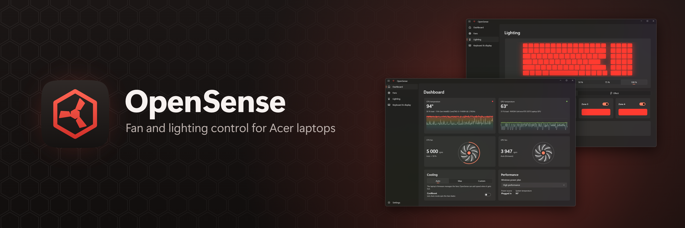

<div align="center">



**Acer Nitro ve Predator dizüstü bilgisayarlar için fan, performans ve aydınlatma kontrolü.**<br>
NitroSense'in açık kaynaklı alternatifi.

[](https://github.com/archivesteak/opensense/actions/workflows/build.yml)
[](https://github.com/archivesteak/opensense/releases/latest)
[](../LICENSE)

[**İndir**](https://github.com/archivesteak/opensense/releases/latest) •
[Özellikler](#özellikler) •
[Desteklenen dizüstü bilgisayarlar](#desteklenen-dizüstü-bilgisayarlar) •
[Derleme](#derleme)

[English](../README.md) |
[Bahasa Indonesia](README-id.md) |
[Deutsch](README-de.md) |
[Español](README-es.md) |
[Français](README-fr.md) |
[Polski](README-pl.md) |
[Português (Brasil)](README-pt-BR.md) |
[Tiếng Việt](README-vi.md) |
**Türkçe** |
[Русский](README-ru.md) |
[Українська](README-uk.md) |
[简体中文](README-zh-CN.md) |
[繁體中文](README-zh-TW.md)

OpenSense'i ve bu sayfayı kendi dilinize çevirmemize yardım edin: [Çeviriler](#çeviriler) bölümüne bakın.

</div>

## Özellikler

- **Gerçek sıcaklıklar.** CPU ve GPU sıcaklıkları, HWiNFO ve ThrottleStop'un yaptığı gibi doğrudan yongaların kendisinden okunur; 5 dakikalık grafiklerle.
- **Fan kontrolü.** Dizüstü ısındığında OpenSense'in hızlandırdığı Otomatik (kapatılabilir), Maks. ya da Özel: her fana eklenen, sabit veya kendi çizdiğiniz bir eğriyi izleyen hız.
- **Varsayılan olarak güvenli.** Kısılma önleme, işlemci kısılma noktasına yaklaştıkça fanları tam hıza çıkarır; bir sensör ya da OpenSense durursa denetimi yeniden bellenim devralır.
- **Performans.** Çalışma modları, CoolBoost ve Windows güç planları.
- **Aydınlatma.** Klavye bölgesi başına sabit renkler ya da Nefes, Neon, Dalga, Kayma ve Yakınlaştırma efektleri.
- **Klavye ve ekran.** Arka ışığı otomatik kapatma, Windows tuşu kilidi, LCD overdrive ve GPU (MUX) anahtarı.
- **Yönetici istemi yok.** Küçük bir arka plan hizmeti ayarlarınızı sistem açılışından itibaren uygular ve NitroSense tuşu uygulamayı açar.
- **Sizin diliniz.** 36 dil; Windows'u izler veya ayarlardan seçilir.

OpenSense, dizüstü bilgisayarınızda neler olduğunu bellenime sorar ve yalnızca desteklenenleri gösterir.

## Kurulum

En son sürümü [**Releases**](https://github.com/archivesteak/opensense/releases/latest) sayfasından indirin (Windows 10 2004 veya üzeri, 64 bit):

- **`OpenSense-<version>-Setup-x64.exe`**: yükleyici. OpenSense'in ihtiyaç duyduğu her şeyi içerir ve kendini güncel tutar.
- **`OpenSense-<version>-Portable-x64.zip`**: kurulum gerektirmez. Yönetici hakları ister ve dizüstü bilgisayarı yalnızca açıkken denetler.
  PawnIO sürücüsünü içermez; bu yüzden onu [PawnIO sürümlerinden](https://github.com/namazso/PawnIO.Setup/releases/latest) ayrıca yükleyene kadar CPU sıcaklığı dizüstü bilgisayarın belleniminden gelir ve daha az kesindir.

> [!NOTE]
> OpenSense'i kullanmadan önce NitroSense'i kapatın (veya kaldırın), aksi hâlde ikisi fanlar için çekişir.

## Desteklenen dizüstü bilgisayarlar

NitroSense ve PredatorSense'in kullandığı oyun bellenim arabirimine sahip Acer dizüstü bilgisayarlar.

OpenSense bir **Nitro 5 AN515-57** üzerinde geliştirildi.

Başka bir modelde denediniz mi? [Bir issue açın](https://github.com/archivesteak/opensense/issues) ve **Ayarlar → Sorun giderme → Kopyala** ile alınan tanılama bilgilerini yapıştırın.

## Çeviriler

OpenSense, Windows'un görüntüleme dilini veya **Ayarlar → Görünüm → Dil** bölümünde seçilen dili kullanır. Bu sayfa dahil çevirilerin hiçbiri henüz anadili konuşan biri tarafından gözden geçirilmedi, bu yüzden düzeltmeler memnuniyetle karşılanır.

Uygulamanın metinleri `src/OpenSense.App/Strings/<language>/Resources.resw`, yükleyicininkiler ise `installer/Strings/<language>.nsh` içindedir; İngilizce dosyalarda her metin için bir not vardır. `dotnet test`, her çevirinin tüm metinleri ve yer tutucuları içerdiğini denetler. Bu sayfanın çevirileri [`docs`](.) klasöründedir.

## Derleme

Windows'ta [.NET 10 SDK](https://dotnet.microsoft.com/download) gerekir.

```powershell
dotnet build
dotnet test --project tests/OpenSense.Core.Tests
```

Her push [GitHub Actions](../.github/workflows/build.yml) tarafından derlenir, test edilir ve paketlenir; yükleyicinin [NSIS](https://nsis.sourceforge.io) ile nasıl oluşturulduğu da orada görülür. `v1.2.3` gibi bir etiket göndermek yeni bir sürüm yayımlar.

## Teşekkürler

- [PawnIO](https://pawnio.eu): CPU sıcaklıklarını okuyan imzalı sürücü (modülleri LGPL-2.1 lisanslıdır)
- [Windows App SDK](https://github.com/microsoft/WindowsAppSDK), [Win2D](https://github.com/microsoft/Win2D) ve [Windows Community Toolkit](https://github.com/CommunityToolkit/Windows)
- [H.NotifyIcon](https://github.com/HavenDV/H.NotifyIcon), [StreamJsonRpc](https://github.com/microsoft/vs-streamjsonrpc) ve [Serilog](https://serilog.net)

## Lisans

OpenSense, [GNU General Public License v3.0 veya sonraki sürümleri](../LICENSE) ile lisanslanmıştır.

Birlikte çalışabilirlik analizine dayanarak yazılmış bağımsız bir projedir ve Acer kodu içermez. Acer ile bağlantılı değildir ve Acer tarafından onaylanmamıştır. Acer, Nitro, Predator ve NitroSense, Acer Inc.'in ticari markalarıdır.
